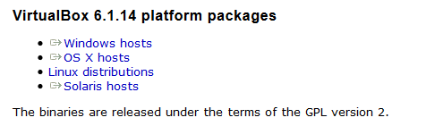

**Подготовительный этап.**

Установка Ubuntu 18.04 LTS в виртуальной машине в ОС *Windows*

**Установка Virtual Box**

Скачать VM VirtualBox можно с [официального сайта разработчика](https://www.virtualbox.org/wiki/Downloads)

Выберите **VirtualBox 6.1.14 platform** для *Windows hosts*. 

*Версия может отличаться.*
